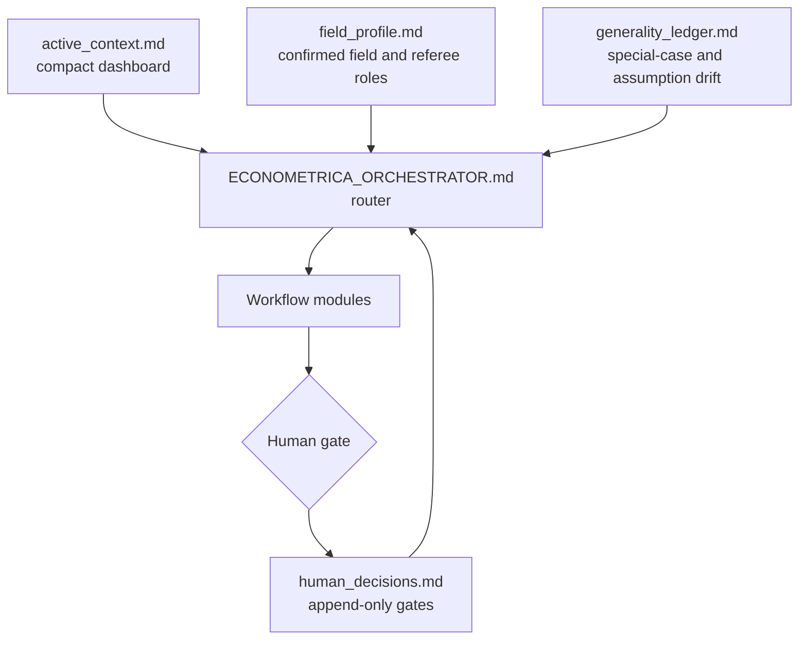

# Econ Theorist AI

An AI system for economic theorists, from idea discovery to theory paper
development.

Originally developed with Econometrica-level theory standards in mind, this
unofficial local workflow system helps researchers move from rough ideas to
primitive hunting, model tournaments, theorem candidates, absorption tests, human
gates, simulated review, and controlled revision paths.

This project is not affiliated with Econometrica. The phrase
`Econometrica-level` is used only as shorthand for high standards of theoretical
clarity, novelty, and rigor.

If this workflow helps your research, please consider giving the repository a
star so more researchers can find and improve their own research process.

## Workflow Map


## Control Layer



`active_context.md` is only a dashboard, not a source of truth. Important claims
must still be checked against the underlying workflow artifacts.

## What This System Does

- Searches for research directions without immediately forcing mainstream taste.
- Preserves 1-2 non-mainstream but internally coherent directions during discovery.
- Runs Primitive Hunter / Theorem Generator panels when the primitive is unclear.
- Compares model variants before manuscript writing.
- Requires absorption tests against closest literature and known theory families.
- Uses `field_profile.md` to assign field-sensitive simulated referees.
- Records human gate decisions in `human_decisions.md` instead of relying on chat memory.
- Tracks assumption and generality drift in `generality_ledger.md`.
- Uses Scientific Judge / Nugget Test safeguards against defensive complexity.
- Runs simulated Econometrica review with dynamic referee roles.
- Routes local-optimum traps back to discovery before manuscript polishing.
- Supports Python, Mathematica, Lean, LaTeX, and git-based verification workflows.

## Quick Start

Copy these files into the root directory of a paper project:

```text
AGENTS.md
ECONOMETRICA_ORCHESTRATOR.md
ECONOMETRICA_PANEL_PROTOCOL.md
ECONOMETRICA_DISCOVERY_WORKFLOW.md
ECONOMETRICA_VERIFICATION_WORKFLOW.md
ECONOMETRICA_AI_HUMAN_WORKFLOW.md
ECONOMETRICA_VERSION_CONTROL.md
TOOLCHAIN_README.md
verify_toolchain.ps1
verification_templates/
```

Then open the paper folder in Codex Desktop. `AGENTS.md` should be read
automatically, and `ECONOMETRICA_ORCHESTRATOR.md` acts as the router.

Recommended command:

```text
Use the system: continue from the current state.
```

Chinese equivalent:

```text
按系统继续。
```

## Common Commands

```text
Use the system: I want to explore a new research topic.
```

```text
Use the system: run a model tournament and absorption test before writing.
```

```text
Use the system: run Primitive Hunter and identify the deepest primitive.
```

```text
Use the system: rigorously verify Proposition 1 with Python, Mathematica, or Lean if useful.
```

```text
Use the system: run a full simulated Econometrica review.
```

```text
Use the system: revise with agentic tree search instead of a defensive patch.
```

```text
按系统处理：这个项目是不是陷入局部最优或越改越复杂？
```

## Files

| File | Purpose |
| --- | --- |
| `AGENTS.md` | Project-level instructions for Codex and compatible agents. |
| `ECONOMETRICA_ORCHESTRATOR.md` | Natural-language router for workflow modules and stages. |
| `ECONOMETRICA_DISCOVERY_WORKFLOW.md` | Topic discovery, primitive hunting, model tournaments, and theorem gates. |
| `ECONOMETRICA_PANEL_PROTOCOL.md` | Independent panels, dynamic referee assignment, AE synthesis, and Co-Editor decisions. |
| `ECONOMETRICA_AI_HUMAN_WORKFLOW.md` | Manuscript development, simulated review, revision trees, and human gates. |
| `ECONOMETRICA_VERIFICATION_WORKFLOW.md` | Mathematical derivation, counterexample search, symbolic checks, and formal verification. |
| `ECONOMETRICA_VERSION_CONTROL.md` | Git checkpoints, branches, diffs, rollback safety, and version logs. |
| `TOOLCHAIN_README.md` | Local Python, Lean, Mathematica, and verification setup. |
| `verify_toolchain.ps1` | Quick local toolchain self-test. |
| `verification_templates/` | Starter templates for counterexample search and Lean lemmas. |

## Runtime Artifacts

These files are created inside paper projects, not maintained as fixed files in
this workflow repository:

| Artifact | Purpose |
| --- | --- |
| `active_context.md` | 80-120 line continuation dashboard. |
| `human_decisions.md` | Append-only human gate decisions, reversals, and reasons. |
| `field_profile.md` | Confirmed or provisional field profile for literature and referee routing. |
| `generality_ledger.md` | Record of special-case moves, assumptions, and theorem-sentence drift. |
| `model_tournament.md` | Comparison of model variants and documented winners/losers. |
| `absorption_tests.md` | Tests for whether the result is absorbed by existing theory. |
| `referee_reports/round_N/` | Simulated referee, AE, Co-Editor, and summary reports. |

## Toolchain

Keep Python, Lean/elan, Mathlib, and large package caches outside paper folders.
On Windows the recommended shared tool root is:

```text
C:\Tools\CodexVerification
```

You can choose another location by setting `CODEX_VERIFICATION_HOME` or by
passing `-ToolRoot` to `verify_toolchain.ps1`.

Minimum setup check:

```powershell
.\verify_toolchain.ps1
```

If the script cannot find Python, Lean, or Mathematica, the workflow still works
as prompts and checklists, but mathematical verification is weaker until the tool
root is configured. See `TOOLCHAIN_README.md` for details.

## Design Principles

- Scientific taste is a filter, not the sole objective.
- Token economy must never override research quality.
- Main theorem discovery, proof verification, closest-literature checks, and simulated review require enough context and tools.
- Human gate decisions must be written to persistent artifacts.
- Simulated acceptance is a diagnostic benchmark, not a publication guarantee.
- If the paper is stuck in local polishing, return to primitive hunting and model discovery.
- The preferred path is theorem note first, manuscript second.

## Feedback and Issues

This project currently uses an issue-only feedback model.

Please open a GitHub Issue if you find:

- unclear workflow routing
- internal contradictions
- missing safeguards
- confusing documentation
- toolchain setup problems
- examples where the system behaves poorly
- suggestions that may help researchers use the system better

Pull requests are not the preferred contribution path at this stage. The
maintainer reviews issues, decides which suggestions to adopt, and integrates
accepted changes directly to preserve consistency across the workflow system.

See `CONTRIBUTING.md` for the current contribution policy.

## License

See `LICENSE`.
