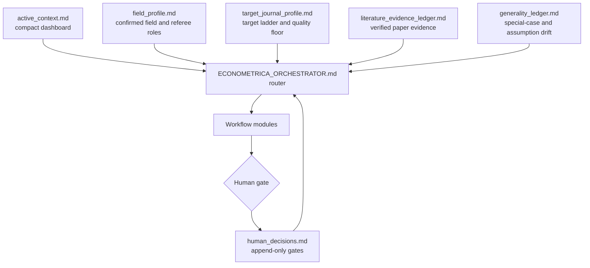

# Econ Theorist AI

An AI system for economic theorists, from idea discovery to theory paper
development.

This is an English-first research workflow system with multilingual command
understanding. You can talk to the assistant in Chinese or English, but research
artifacts, referee reports, theorem notes, and manuscripts are English by
default.

Originally developed with Econometrica-level theory standards in mind, this
unofficial local workflow system helps researchers move from rough ideas to
primitive hunting, example-to-theory model-base construction, model tournaments,
theorem candidates, absorption tests, target journal calibration, human gates,
simulated review, and controlled revision paths.

This project is not affiliated with Econometrica. The phrase
`Econometrica-level` is used only as shorthand for high standards of theoretical
clarity, novelty, and rigor.

The workflow is target-calibrated rather than Econometrica-only. A confirmed
`target_journal_profile.md` can calibrate the reader path, referee mix,
exposition style, and fit standard for RAND, JET, Theoretical Economics, GEB,
ReStud, AER, or another venue. Target journal changes calibration, not quality.

If this workflow helps your research, please consider giving the repository a
star so more researchers can find and improve their own research process.

## Workflow Map

```mermaid
flowchart LR
    A["Topic or rough idea"] --> B["Literature probe<br/>field_profile.md<br/>literature_evidence_ledger.md"]
    B --> T["Target profile<br/>target_journal_profile.md"]
    T --> C["Primitive Hunter<br/>tree search + nonconvex branches"]
    C --> D["Model tournament"]
    D --> MB["Example-to-theory<br/>model_base_design.md"]
    MB --> E["First-pass derivation"]
    E --> F["Absorption test<br/>main theorem gate"]
    F --> G["5-8 page model note"]
    G --> H["Manuscript development"]
    H --> S["Deep style anchor pass<br/>style_calibration.md"]
    S --> I["Target-calibrated<br/>simulated review"]
    S -->|structural weakness| C
    I --> J["Revision tree"]
    J --> K{"Human decision"}
    K -->|preserve or revise| H
    K -->|simplify or pivot| C
    K -->|submit or retarget| L["Final readiness"]
```



## Control Layer



`active_context.md` is only a dashboard, not a source of truth. Important claims
must still be checked against the underlying workflow artifacts.

## What This System Does

- Treats ordinary explanatory, translation, GitHub, software, or conceptual questions as ordinary Q&A.
- Runs research execution seriously by default once the user asks the system to act on an idea, model, theorem, literature, manuscript, review, revision, or project state.
- Uses simple user commands while keeping explicit human gates for major decisions.
- Searches for research directions without immediately forcing mainstream taste.
- Preserves 1-2 non-mainstream but internally coherent directions during discovery.
- Records closest-paper, anchor-paper, absorption-threat, and style-anchor evidence in `literature_evidence_ledger.md`.
- Runs Primitive Hunter / Theorem Generator panels when the primitive is unclear.
- Treats user-supplied model details as provisional modeling constraints until a model-base gate confirms them.
- Searches broadly over cheap model skeletons, then derives narrowly from the few model bases that survive.
- Builds models from small examples and economic tensions before fixed point or existence machinery enters.
- Compares model variants before manuscript writing and uses nonconvex branch generation inside the existing tree search.
- Requires absorption tests against closest literature and known theory families.
- Uses `field_profile.md` to assign field-sensitive simulated referees.
- Uses `target_journal_profile.md` to recommend and confirm a primary, stretch, and fallback target without lowering the quality floor.
- Records human gate decisions in `human_decisions.md` instead of relying on chat memory.
- Tracks assumption and generality drift in `generality_ledger.md`.
- Uses Scientific Judge / Nugget Test safeguards against defensive complexity.
- Runs target-calibrated simulated review with dynamic referee roles.
- Routes local-optimum traps back to discovery before manuscript polishing.
- Calibrates exposition style through a Deep Style Anchor Pass after the contribution is locked.
- Uses full-text style anchors when legally available or user-provided, extracting exposition architecture rather than prose.
- Supports Python, Mathematica, Lean, LaTeX, and git-based verification workflows.

## Start In 5 Minutes

1. Download the repository as a ZIP file or clone it.
2. Copy these files into the root directory of your paper project:

```text
AGENTS.md
ECONOMETRICA_ORCHESTRATOR.md
ECONOMETRICA_PANEL_PROTOCOL.md
ECONOMETRICA_DISCOVERY_WORKFLOW.md
ECONOMETRICA_VERIFICATION_WORKFLOW.md
ECONOMETRICA_AI_HUMAN_WORKFLOW.md
ECONOMETRICA_VERSION_CONTROL.md
FIRST_RUN.md
TOOLCHAIN_README.md
verify_toolchain.ps1
verification_templates/
```

3. Open the paper folder in Codex Desktop or another agent IDE. `AGENTS.md`
should be read automatically, and `ECONOMETRICA_ORCHESTRATOR.md` acts as the
router.

4. Run a first-run setup check:

```text
Use the system: first-run setup check
```

Small Chinese command example:

```text
按系统处理：初始化检测
```

5. Initialize the paper project:

```text
Use the system: initialize this paper project
```

## Common Commands

```text
Use the system: first-run setup check.
```

```text
Use the system: initialize this paper project.
```

```text
Use the system: continue by the system.
```

```text
Use the system: quickly screen this idea.
```

```text
Use the system: run a full literature audit.
```

```text
Use the system: I want to explore a new research topic.
```

```text
Use the system: run a model tournament and absorption test before writing.
```

```text
Use the system: find the minimal model base before formal derivation.
```

```text
Use the system: run Primitive Hunter and identify the deepest primitive.
```

```text
Use the system: rigorously verify Proposition 1 with Python, Mathematica, or Lean if useful.
```

```text
Use the system: recommend a target journal ladder for this project.
```

```text
Use the system: run a full target-calibrated simulated review.
```

```text
Use the system: what should I do today?
```

```text
Use the system: where is this project stuck?
```

```text
Use the system: if I only have two hours, what is the highest-value next action?
```

```text
Use the system: revise with agentic tree search instead of a defensive patch.
```

Small Chinese command examples:

```text
按系统继续
```

```text
快速看看这个想法
```

```text
完整审查一遍
```

```text
今天我该做什么
```

## Files

| File | Purpose |
| --- | --- |
| `AGENTS.md` | Project-level instructions for Codex and compatible agents. |
| `ECONOMETRICA_ORCHESTRATOR.md` | Natural-language router for workflow modules and stages. |
| `ECONOMETRICA_DISCOVERY_WORKFLOW.md` | Topic discovery, primitive hunting, model tournaments, and theorem gates. |
| `ECONOMETRICA_PANEL_PROTOCOL.md` | Independent panels, dynamic referee assignment, AE synthesis, and Co-Editor decisions. |
| `ECONOMETRICA_AI_HUMAN_WORKFLOW.md` | Manuscript development, simulated review, revision trees, and human gates. |
| `ECONOMETRICA_VERIFICATION_WORKFLOW.md` | Mathematical derivation, counterexample search, symbolic checks, and formal verification. |
| `FIRST_RUN.md` | First-run setup guide for non-technical users. |
| `ECONOMETRICA_VERSION_CONTROL.md` | Git checkpoints, branches, diffs, rollback safety, and version logs. |
| `TOOLCHAIN_README.md` | Local Python, Lean, Mathematica, and verification setup. |
| `verify_toolchain.ps1` | Quick local toolchain self-test and status writer. |
| `verification_templates/` | Starter templates for counterexample search and Lean lemmas. |

## Runtime Artifacts

These files are created inside paper projects, not maintained as fixed files in
this workflow repository:

| Artifact | Purpose |
| --- | --- |
| `active_context.md` | 80-120 line continuation dashboard. |
| `human_decisions.md` | Append-only human gate decisions, reversals, and reasons. |
| `field_profile.md` | Confirmed or provisional field profile for literature and referee routing. |
| `target_journal_profile.md` | Confirmed or provisional target ladder, fit standard, quality floor, and reader calibration. |
| `literature_evidence_ledger.md` | Verified source records for closest papers, anchors, absorption threats, and style anchors. |
| `generality_ledger.md` | Record of special-case moves, assumptions, and theorem-sentence drift. |
| `model_base_design.md` | Example-to-theory model base, skeleton funnel, failed simpler alternatives, and human confirmation status. |
| `heuristic_derivation.md` | Economic derivation path from toy example to formal model before proof machinery begins. |
| `style_anchor_notes/` | Per-anchor notes from deep reading of legally available or user-provided style anchors. |
| `style_anchor_matrix.md` | Cross-anchor matrix of exposition architecture, reader path, theorem setup, and proof roadmap moves. |
| `style_calibration.md` | Human-confirmed style contract for elegant, field-calibrated exposition without rhetoric. |
| `style_pass_plan.md` | Section-by-section plan for paragraph-level style correction after style confirmation. |
| `spike_dossier.md` | Optional focused dossier for a possible frontier spike that survives D6. |
| `literature_cache/` | Optional local cache for user-authorized or open-access papers; bulk download is not the default. |
| `literature_cache/style_anchors/` | Optional cache for legally available or user-authorized style anchor PDFs. |
| `toolchain_status.md` | Computer-level diagnostic status, usually stored globally outside the paper project. |
| `model_tournament.md` | Comparison of model variants and documented winners/losers. |
| `absorption_tests.md` | Tests for whether the result is absorbed by existing theory. |
| `referee_reports/round_N/` | Simulated referee, AE, Co-Editor, and summary reports. |

## Path Display And PDF Outputs

Windows paths can be mangled by Markdown if backslashes are written as raw text.
The workflow therefore treats path display as an output-safety rule:

- local paths and compiled PDF paths should be shown in backticks or fenced code
  blocks, not raw prose;
- file cards and Markdown file links should use the filename only as the visible
  title; the full absolute path belongs on a separate `Full path:` line;
- generated PDFs should be reported only after the exact path is verified with
  `Test-Path -LiteralPath` or `Resolve-Path -LiteralPath`;
- commands should quote paths with spaces, and path construction should use
  `Join-Path`, `Resolve-Path -LiteralPath`, `pathlib`, or an equivalent path API.

Example:

```text
File card:
[main.pdf](<C:/Dropbox/Shufe/Research/Project/My Paper/output/main.pdf>)

Full path:
`C:/Dropbox/Shufe/Research/Project/My Paper/output/main.pdf`

Open command:
`Start-Process -FilePath "C:\Dropbox\Shufe\Research\Project\My Paper\output\main.pdf"`
```

## If You Use Git

Generated research files are saved locally in each paper project folder. They are
not automatically uploaded to GitHub. The workflow works locally even if you
never use Git.

If you use GitHub as a backup for a paper project, you may choose which generated
research files to track. Durable research records that are often worth tracking
include:

```text
human_decisions.md
project_state.md
contribution_lock.md
field_profile.md
target_journal_profile.md
literature_evidence_ledger.md
model_tournament.md
model_base_design.md
heuristic_derivation.md
absorption_tests.md
generality_ledger.md
risk_register.md
revision_tree.md
revision_log.md
version_log.md
```

Files that usually do not need to be tracked include:

```text
active_context.md
toolchain_status.md
referee_reports/
verification/
formal/
lean/
large local caches
```

## Toolchain

Keep Python, Lean/elan, Mathlib, and large package caches outside paper folders.
On Windows the recommended shared tool root is:

```text
C:\Tools\CodexVerification
```

You can choose another location by setting `CODEX_VERIFICATION_HOME` or by
passing `-ToolRoot` to `verify_toolchain.ps1`.

Minimum setup check:

```powershell
.\verify_toolchain.ps1 -WriteStatus
```

If the script cannot find Python, Lean, or Mathematica, the workflow still works
as prompts and checklists, but mathematical verification is weaker until the tool
root is configured. See `TOOLCHAIN_README.md` for details.

## If You Do Not Have Python, Lean, Or Mathematica

You can still use the research workflow. Missing tools only weaken mathematical
verification, local compilation, or formal proof support. They do not block idea
discovery, field profiling, target journal profiling, model tournaments,
simulated review, style calibration, or revision planning.

## Language Policy

The workflow files, project artifacts, referee reports, theorem notes, revision
logs, and manuscripts are English by default.

Chinese commands are supported for convenience, but generated research files
remain English unless the user explicitly requests a separate Chinese
explanatory note outside the manuscript workflow.

## Optional Researcher Memory

Project artifacts are the source of truth. Cross-project memory, if used, is only
an optional prior stored outside paper projects, typically under:

```text
C:\Users\<user>\.econ-theorist-ai\
```

Possible files include `researcher_profile.md`, `method_library.md`,
`negative_knowledge.md`, `proof_technique_memory.md`, `project_postmortems/`,
and `field_maps/`. Literature evidence, proof verification, and current human
gate decisions override researcher memory.

## Design Principles

- Scientific taste is a filter, not the sole objective.
- Simple commands must not weaken human gates.
- Research execution is serious by default, while ordinary Q&A remains ordinary Q&A.
- Specificity is not stage advancement: formal model language from the user is provisional until artifacts and human gates confirm it.
- Exhaust broadly at the model-skeleton level; derive narrowly at the formal level.
- A model is not ready because it is formal; it is ready when its smallest version explains the economic force.
- Nonconvex discovery expands branch generation inside tree search; it does not certify quality.
- Target journal changes calibration, not quality.
- Strong novelty, absorption, anchor, and style claims require evidence recorded in `literature_evidence_ledger.md` or must be marked provisional.
- Deep style calibration means deep style reading, not prose imitation.
- Style anchors are used to extract exposition architecture, not sentences, paragraph structures, or framing.
- Token economy must never override research quality.
- Main theorem discovery, proof verification, closest-literature checks, and simulated review require enough context and tools.
- Human gate decisions must be written to persistent artifacts.
- Simulated acceptance is a diagnostic benchmark, not a publication guarantee.
- If the paper is stuck in local polishing, return to primitive hunting and model discovery.
- The preferred path is theorem note first, manuscript second.

## Planned Public-Use Improvements

- Toy worked examples.
- Benchmark cases.
- Richer verification templates.
- Optional cross-platform toolchain notes.

## Feedback and Issues

This project currently uses an issue-only feedback model.

Please open a GitHub Issue if you find:

- unclear workflow routing
- internal contradictions
- missing safeguards
- confusing documentation
- toolchain setup problems
- examples where the system behaves poorly
- suggestions that may help researchers use the system better

Pull requests are not the preferred contribution path at this stage. The
maintainer reviews issues, decides which suggestions to adopt, and integrates
accepted changes directly to preserve consistency across the workflow system.

See `CONTRIBUTING.md` for the current contribution policy.

## Citation And Credit

If this system helps your research, please cite the repository and consider
starring it on GitHub so other researchers can find it.

GitHub should display a "Cite this repository" option from `CITATION.cff`.

Suggested plain-text citation:

```text
viplee110. econ-theorist-ai: An AI workflow system for economic theory research.
GitHub repository, 2026. https://github.com/viplee110/econ-theorist-ai
```

## License

Licensed under the Apache License 2.0. See `LICENSE`.
